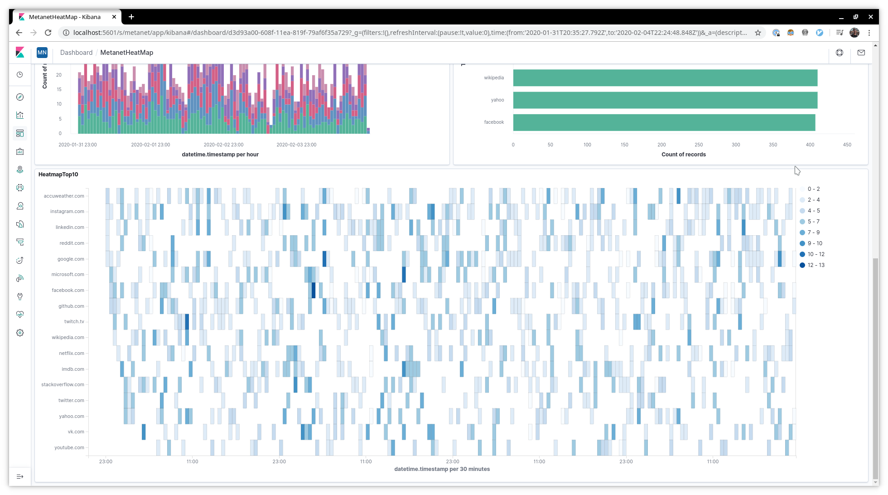

# MetaNet

MateNet - network metadata analyzist & visualization

|         |                     |
| ------- | ------------------- |
| Subject | Digital Forensics   |
| Student | Dalibor Aleksic 888 |
| Faculty | ELFAK               |

---

## Requirements

- Docker & docker-compose
- Python 3

## Usage

### Step 1: Start Elasticsearch and Kibana

```bash
docker-compose up -d
```

### Step 2: Initialize Elasticsearch and Kibana

```bash
python metanet setup init
```

### Step 3: Analyze data

You can analyze existing PCAP file by using:

```bash
python metanet analyze pcap -f example.pcap
```

or you can generate sample data using:

```bash
python metanet analyze sample --from 2020-01-01 --to 2020-01-07
```

### Step 4: Open Kibana and explore dashboards

```curl
http://localhost:5601/s/metanet/
```




## Cleanup

If you are using provider docker images you can execute:

```
docker-compose down
```

to remove everything.

Or if you are using own provided elasticsearch and kibana instance you can cleanup using:

```
python metanet setup cleanup
```

command that will delete elasticsearch index and kibana space.
