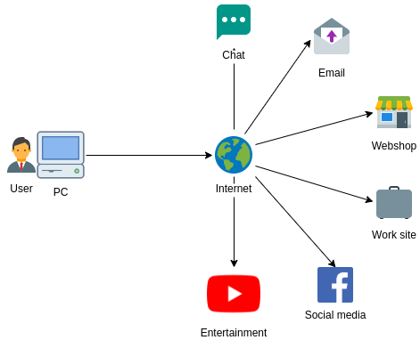
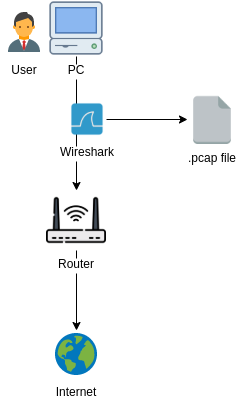
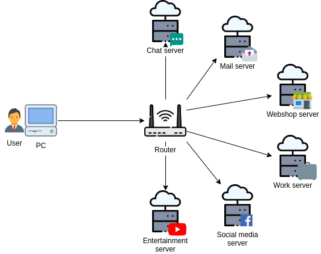
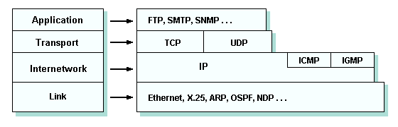
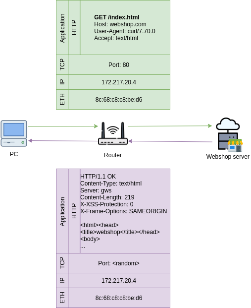
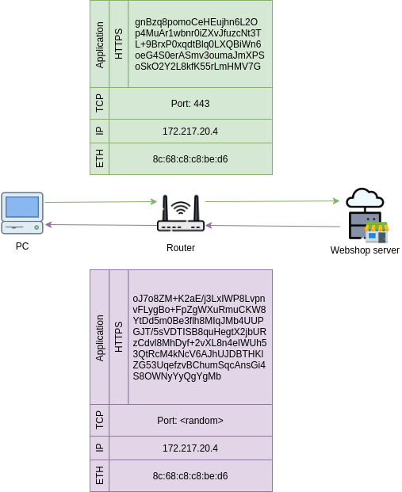
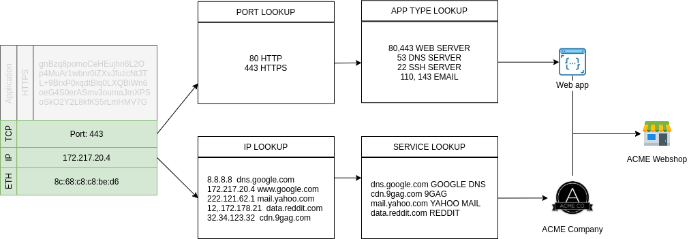
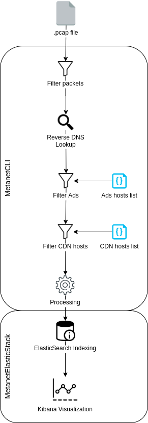
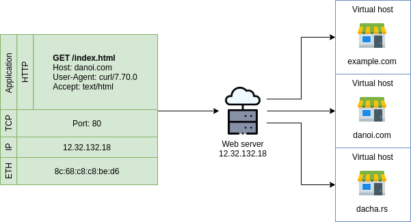
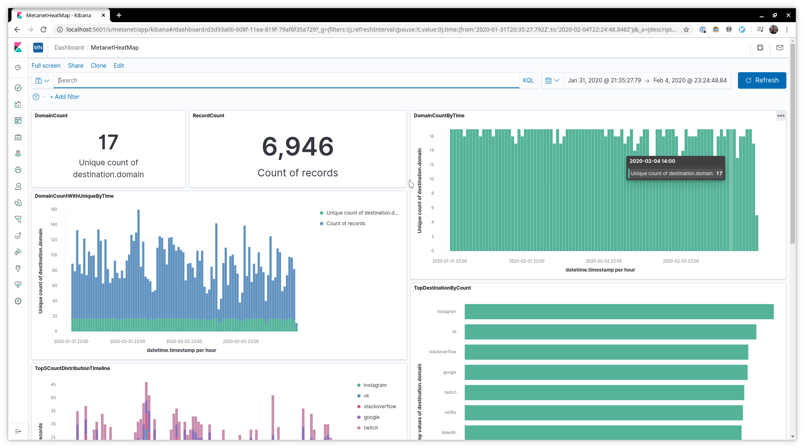

# Forenzika mrežnog saobracaja - praćenje putem metapodataka


[TOC]

## Uvod

**Digitalna forenzika** je grana forenzičke nauke koja se bavi oporavkom i istraživanjem digitalnih materijala u digitalnim uređajima. Digitalna forenzika je vrlo često povezana sa kompjuterskim kriminalom. Ova grana nauke ima vrlo različite primene. Najčesća primena je da potvrdi ili ospori neku tvrdnju na prekršajnom sudu. Takođe se primenjuje i u privatnom sektoru, najčešće kad se istražuje neki incident ili upad unutar kompanije, kao što je naprimer mrežni upad unutar privatne infrastrukture kompanije.

Zavisno od tipa istraživanja digitalna forenzika se može podeliti na nekoliko pod grana:

- računarska forenzika
- mrežna forenzika
- forenzika analiza podataka
- forenzika mobilnih uređaja

Tipičan forenzički tok se sastoji od

- zaplena digitalnog uređaja lica koje se tereti za prekršaj
- forenzičko dokumentovanje i perzistiranje gde se obezbeđuje da originalni materijal ne bude uništen tokom analize
- analiza digitalnog materijala
- pravljenje izveštaja analiziranog digitalnog materijala

**Mrežna forenzika** se bavi nadgledanjem (monitoringom) i analizom mrežnog saobraćaja, kako lokalnog (LAN) tako i spoljnog (WAN/Internet) saobraćaja, za potrebe prikupljanja informacija, prikpljanja dokaza i detekcija upada u mreži. Saobraćaj se najčešće presreće i prikuplja na nivou paketa. Paketi se zatim ili:

- skladište za kasniju analizu 
- filtriraju i analiziraju u realnom vremenu

Za razliku od drugih grana forenizke, kod mrežne forenzike podaci su veoma dinamični, nestabilni i pokretljivi, vrlo retko se evidentiraju, što može da dosta da oteža njihovu analizu.


## Metanet alat

**Metanet** alat služi da analizira i vizualizuje unapred prikupljene mrežne pakete i omogući uočavanje šablona u komunikaciji između određenog računara i ostatka mreže uključujući interneta.



Slika 1

Pod pretpostavkom da određeni računar koristi samo jedan korisnik, cilj ovog alata je do pomogne u zaključivanju i određivanju aktivnosti korisnika tog računara. Alat treba da pomogne da se uoče najčešće posećivanje i koršćenje web servise, u kojim vremenskim trenucima su web servisi korišćeni i koliko dugo su koriščeni. Takođe podatke je moguće filtrirati i sortirati po brojnim kriterijumima.


### Princip analize

Metanet analizira mrežne pakete koji su prikupljeni na čvoru mreže između korisnikovog računara i ostatka mreže. Tipično zgodno mesto za prikupljanje ovih podataka je na samom korisnikovom računaru gde je moguće pratiti i lokalni saobraćaj i internet saobraćaj. Takođe je moguće ove podatke prikupljat i na samom ruteru - tj. gatewayu lokalne mreže gde se može pratiti kompletan internet saobraćaj korsnika, ali je limitirano praćanje unutar lokalne mreže.

Na slici je data šema jedanog primer primera prikupljanja podataka, gde se koristi Wireshark alat za prikupljanje mrežnih paketa i njihovo skladištenje u `.pcap` fajl formatu koje se kasnije koristi za analizu u `metanet` alatu. 



Metanet se ne bavi problemom prikupljanja ovih podataka, već analizira isključivo već sačuvane pakete u `.pcap` fajlu.

Komunikaciju sa diagrama 1, koja pokazuje interakciju korisnika sa web servisima, se preciznije moze prikazati na diagramu 3:



Svaki od servisa je zapravo udaljeni računar - server na mreži. Komunikacija se obavlje putem korišćenjem određenog aplikacionog protokola TCP/IP mrežnog stack-a. 



Analiza komunikacije na najvišem nivou je svakako najpogodnija, ali ujedno i najteža. Na ovom nivou se može dobiti najviše informacija o komunikaciji i sadrži veoma osetljive informacije. 

Uzmimo za primer HTTP protokol i komunikaciju između korisnika i web servisa - recimo webshop servisa.



- Korisnički pregledač na aplikativnom nivou generiše zahtev za učitavanje početne stranice webshopa:

  ```
GET /index.html
  Host: webshop.com
  User-Agent: curl/7.80.0
  Accept: text/html
  ```
  
- Posto se radi o HTTP protokolu, na TCP nivou se naznacava da je paket namenjen servisu na portu 80 na udaljenom racunaru, ko kome slusa odgovarajuca HTTP aplikacija

- Udaljeni server prosesira zahtev korisnika i odgovara na njegov zahtev:

  ```
  HTTP/1.1 OK
  Content-Type: text/html
  Server: gws
  Content-Length: 219
  X-XSS-Protection: 0
  X-Frame-Options: SAMEORIGIN
  
  <html>
  <head>
  <title>webshop</title>
  </head>
  <body>
  ...
  ```

- U toku transporta, ovaj paket prolazi kroz mnogobrojne mrežne uređaje. Svaki od ovih međučvorova je u mogućnosti da vidi sadržaj paketa, uključujući i sadržaj na aplikativnom nivou.

Pošto se u paketu mogu nalaziti podaci osetljive prirode, kao što su kredencijali, `https` protokol pokušava da sadržaj na aplikativnom nivou zaštiti od čitanja trećeg lica u komunikaciji. HTTPS protokol je unapređenje HTTP protokola, koji enkapsulira funkcionalnost HTTP protokola još jednim slojem koji je zadužen da uspostavi i održava bezbednu vezu između dve strane. HTTPS protokol obezbeđuje verifikaciju odredišta i bezbedan transfer podataka između izvora i odredišta korišćenjem enkripcije. 

Komunikacija sa mrežnog nivoa izgleda slično kao kod HTTPa, s tim što prilikom uspostave veze imamo proces obezbeđivanje bezbedne veze - razmena ključeva, i sadržaj na aplikativnom nivou nije više čitljiv.




- Korisnički pregledač na aplikativnom nivou generiše zahtev za učitavanje početne stranice webshopa:

  ```
  GET /index.html
  Host: webshop.com
  User-Agent: curl/7.80.0
  Accept: text/html
  ```

- Sadržaj se pre slanja najpre enkriptuje javnim ključem koji je dobio od strane odredišta koji je dobio u procesu uspostave veze za odredištem:

  ```
  gnBzq8pomoCeHEujhn6L2O
  p4MuAr1wbnr0iZXvJfuzcNt3T
  L+9BrxP0xqdtBlq0LXQBiWn6
  oeG4S0erASmv3oumaJmXPS
  oSkO2Y2L8kfK55rLmHMV7G
  ```

- Pošto se radi o HTTPS protokolu, na TCP nivou se naznacava da je paket namenjen servisu na portu 443 na udaljenom racunaru, ko kome slusa odgovarajuca HTTPS aplikacija

- Udaljeni server prima paket, dekriptuje sadržaj, prosesira zahtev korisnika i odgovara na njegov zahtev:

  ```
  HTTP/1.1 OK
  Content-Type: text/html
  Server: gws
  Content-Length: 219
  X-XSS-Protection: 0
  X-Frame-Options: SAMEORIGIN
  
  <html>
  <head>
  <title>webshop</title>
  </head>
  <body>
  ...
  ```

- Sadržaj paketa se prilikom slanja takođe enkriptuje i enkriptovani sadržaj se vraća korisniku:

  ```
  oJ7o8ZM+K2aE/j3LxIWP8Lvpn
  vFLygBo+FpZgWXuRmuCKW8
  YtDd5m0Be3flh8MIqJMb4UUP
  GJT/5sVDTISB8quHegtX2jbUR
  zCdvl8MhDyf+2vXL8n4eIWUh5
  3QtRcM4kNcV6AJhUJDBTHKl
  ZG53UqefzvBChumSqcAnsGi4
  S8OWNyYyQgYgMb
  ```

- U toku transporta, ovaj paket prolazi kroz mnogobrojne mrežne uređaje. Svaki od ovih međučvorova moze da pročita sadržaj paketa, ali je sadržaj paketa nerazumljiv.

Skoro svi protokoli (osim uglavnom zastarelih kao što je TELNET) implementiraju neki vid bezbednostnih mehanizama koji sprečavaju mogućnost njihovog čitanja, tj. implementiraju različite metode enkripcije podataka. Podaci komunikacije treba da vide samo izvorište i odredište i niko između u toku transporta. Iz ovog razloga, analiza komunikacije na aplikativnom nivou nije pogodna, iako može da sadrži najkorisnije podatke.

Pored toga što sadržaj paketa nije čitljiv, ponašanje u komunikaciji je moguće indirekno zaključiti gledanjem drugih parametara - metapodataka. Iako nije moguće postići isti nivo rezultata kao kada bi smo posmatrali i podatke na aplikativnom nivou, ovom analizom je takođe moguće zaključiti dosta toga:

- Sa kojim odredištima se komunicira
- Sa kojim odredištima se najviše/najčešće komunicira
- U kojim vremenskim periodima se komunicira sa odredištima
- Sa kojom kategorijom odredišta se komunicara
- Sa kojom kategorijom odredišta se se najčešče komunicira
- Sa kojom kategorijom odredišta se kada i u kom periodu komunicira

- Itd..

Od korisnih podataka paketa koji se mogu upotrebiti u analizu komunikacije se mogu svrstati Port i IP adresa odredišta.

Na osnovu porta paketa može se zaključiti o kojoj aplikaciji ili kategoriju aplikacije o kojoj je reč. Port predstavlja komunikacioni endpoint 16-bitni broj koji identifikuje proces ili servis na odredišnom računaru koji učestvuje u komunikaci pošto je moguće i vrlo često da više aplikacija/procesa/servisa na istom sistemu /na istoj IP adresi učestvuje u mrežnoj komunikaciji. Vrednost porta se kreće u opsegu 0 do 65535 i svaka vrednost je unikatna po prosecu na nivou IP adrese - dva procesa ne mogu da koriste isti port na istoj IP adresi. Vrednosti portova i aplikacija nisu u potpunosti standarizovane, ali se mogu izvojiti 3 opsega:

- Dobro poznati portovi, opseg od 1 do 1024 - porotovi sistemskih i aplikacija
- Registrovani portovi, opseg od 1024 do 49151 - standardizovani i registrovani portovi od strane IANA
- Korisnički portovi, opseg 49151 do 65535 - promenljivi i korisnički portovi

| Port | Aplikacija                            |
| ---- | :------------------------------------ |
| 7    | ECHO                                  |
| 20   | FTP Data                              |
| 21   | FTP Control                           |
| 22   | SSH Remote Login Protocol             |
| 23   | TELNET                                |
| 25   | SMTP                                  |
| 53   | Domain Name System (DNS)              |
| 69   | Trivial File Transfer Protocol (TFTP) |
| 80   | HTTP                                  |
| 110  | POP3                                  |
| 115  | Simple File Transfer Protocol (SFTP)  |
| 143  | Interim Mail Access Protocol (IMAP)   |
| 194  | Internet Relay Chat (IRC)             |
| 443  | HTTPS                                 |
| 546  | DHCP Client                           |
| 547  | DHCP Server                           |

IP adresa može da ukaže bliže informacije o kom servisu se radi, ali ne direktno. Sama vrednost IP adrese ne znači ništa, ali se može na osnovu nje potražiti informacije o:

- Whois analiza - u čijem je vlasništvu IP adresa, kog pojedinca ili kompanije
- Reverse DNS lookup - koji domeni su vezani za IP adresu čiji bi nazivi mogli da ukažu blize o kom servisu je reč

Ukoliko se informacije o kompaniji, u čijem je vlasništvu IP adresa, sa njenim softverskim proizvodima povežu sa prethondim podacima, može se doći do zaključka o kom servisu je zapravo reč.

Tako na primer:



|   |   |
| ----------- | ---- |
| Port paketa | 443  |
| IP odredišta paketa | 111.222.121.32  |

Paket je namenjen aplikaciji koja sluša saobraćaj na portu `443`. Iz tabele poznatih portova se vidi da se radi o `HTTPS` protokolu i nekom Web serveru, tako da se očekuje da je reč o nekoj web aplikaciji ili sajtu.

Paket je namenjen serveru na adresi `111.222.121.32`. Sama ova vrednost ništa ne znači. Ukoliko se izvrši obrnuto DNS pretraživanje - ispita koji domen je vezan za ovu IP adresu - vidi se da je reč o `shop.acme.com` (zanemarujući činjenicu da više različitih domena mogu biti vezani za istu IP adresu). Iz naziva domena se može zaključiti da je IP adresa vezana sa shop servis kompanije ACME. 

Kombinovanjem informacije da se najverovatnje radi o web aplikaciji ili sajtu i da je IP adresa vezana za shop kompanije ACME se lako može zaključiti da se radi o internet prodavnici kompanije ACME.

### Analiza paketa

Analiza paketa se vrši iz 2 faze:

- Obrada `.pcap` fajla sa paketima, čiji je zadatak MetanetCLI alata
- Indeksiranje i vizualizacija obrađenih podataka iz prethodne faze, koje se obavlja putem ElasticSearch i Kibana alata



Prva faza analize podrazumeva najpre filtriranje mrežnih paketa. Pošto `.pcap` fajl može sadržati raznovrsne  tipove paketa, kao što su:

- ARP paketi
- HTTP/HTTPS paketi
- DNS paketi
- PING paketi
- Razni drugi protokoli

Iz ovog skupa se najpre izdvajaju paketi koji su od značaja u analizi, a to su:

- DNS paketi

- HTTP/HTTPS paketi 

Primarni fokus analize su HTTP/HTTPS paketi, dok DNS paketi služe kao ispomoć u određivanju domen koji je vezan za IP adresu iz HTTP/HTTPS paketa.

Nakon filtriranja paketa sledi korak u kome se vrši obrnuti DNS upit koji treba da na osnovu IP adrese iz paketa odredi domen kome su ti paketi namenjeni.

Problem na koji se nailazi prilikom obrnutog DNS upita je da se može desiti da za istu IP adresu može biti povezano više različitih domena. To je najčešći slučaj kod shared hosting okruženjima kada jedan isti Web server može da opslužuje više različitih Web sajtova sa različitim domenima. Preslikavanje ne mora biti jedan na jedan u svakom slučaju. Razlikovanje Web sajtova se obajvlja na aplikatinvom nivou. Konkretno, Web serveri uvode koncept virutalnih web servera koji svaki od njih opslužuje jedan web sajt i vezan za jedan domen. U HTTP/HTTPS protokolu se parametrom `Host` specifira odredište, najčešće domen web sajta, gde je deljeni web server u mogućnosti da na osnovu tog parametra jedinstveno odredi kom virtualnom serveru je određeni paket namenjen i koji web sajt treba da opsluži taj paket. 



Pošto se u ovom slučaju analiza ne vrši na aplikativnom nivou, prost reverzibilni DNS upit može dati nedeterminisane rezultate. Stoga se mora primeniti tehnika kojom se pored HTTPS paketa u komunikaciji ujedno prate DNS paketi i to konkretno DNS upiti i odgovori na iste. Iz DNS odgovora se jasno vidi IP adresa, a iz DNS upita se vidi domen za koji je odgovor namenjen. Na osnovu ovih paketa se može na jedinstven način napraviti tabela mapiranja IP adresa i domena koji su relevatni u kontekstu analizirane komunikacije.


Kao i kod celokupnog saobraćaja iz `.pcap` fajla i kod HTTP/HTTPS saobraćaja imamo situaciju da nije ceo saobraćaj relevantan za analizu. U prethodnom slučaju je odbačen sav saobraćaj koji nije vezan za HTTP/HTTPS komunikaciju - saobraćaj drugih protokola. Kod HTTP/HTTPS saobraćaja je ista situacija kad se otvara neki web sajt. Nisu svi resursi na tom sajtu konkretno vezani za ciljani sajt. Konkretno, svaka stranica može da sadrži sadržaj i resurse koji čije poreklo nije sa istog sajta kao što je na primer, resursi java-script biblioteka, slike, reklame itd.. Tako da kada korisnik otvori neki sajt, pored učitavanje sadržaja traženog sajta, dolazi do učitavanje i drugih resursa sa eksternih lokacija. Ti eksterni resursi mogu biti deljeni među različitim sajtovima. Tako na primer, više sajtova mogu da koriste usluge web reklama koje ce biti učitane sa istog eksternog servisa/domena ili da koriste istu zajedničku biblioteku koja će biti očitana sa servera druge kompanije koje pravi i održava tu biblioteku. 


Pošto se analiza ne vrši na aplikativnom nivou, već na nivou ispod, nije moguće precizno odrediti da li se korisnik povezuje na 2 različita portala ili povezuje na jedan portal koji očitava resurse sa drugog servisa. U analizi biće detektovano da se korisnik povezuje na 2 različita portala, stoga je potrebno da se ovi eksterno učitavani resursi raspoznaju.

Naredna 2 koraka treba da obezbede filtriranje podataka koji su vezani za očitavanje eksternih resursa i reklama. Filtriranje radi na principu prepoznavanje domena iz paketa u listi/rečniku već poznatih domena koji se koriste za distribuiranje reklama i eksternih resursa. Lista poznatih domena se generiše na osnovu javno dostupnih listi koji se koriste u sistemima za blokiranje reklama i javno dostupnih listi kompanija koje se bavi kategorizacijom servisa i njihovih domena kao što su:

- AdAway
- AdGuardDNS
- AnuDeep
- EasyList

Metoda za filtriranje nije najpouzdanija, jako zavisi od kvaliteta listi koji se koriste u filtriranju.

Nakon filtriranja podataka, sledi faza procesiranje paketa u kojoj se paketi pripremaju za upisivanje u ElasticSearch bazi i indeksiraju kao i dodatna obrada paketa. Ovde se iz domena odredišta paketa izvlače konkretni podaci o:

-  TDL domenu (top level domain)
- domenu
- pod domenu

U ovoj fazi se takođe izvlače revelatne informacije iz paketa kao što su:

- Timestamp paketa
- Adresa odredišta
- Informacije o domenu

Podaci se formatiraju na odgovarajuću formu za upisivanje i indeksiranje u ElasticSearch bazi i vrši upis podataka u istoj. Prva faza u analizi podataka se ovde završava.

Druga faza je zadužena da procesirane podatke iz prve faze indeksira i vizualno prikaže korisniku tako da omogući uočavanje paterna u komunikaciji, jednostavno pretraživanje podataka kao i mogućnost vršenja analize na određenom periodu komunikacije.

Ovo omogućavaju 2 alata: 

- ElasticSearch baza koji indeksira i pretražuje prerađene podatke tj. pakete
- Kibana koji uz pomoć ElasticSearcha pretražuje podatke i vrši njihovo prikazivanje korisniku, korišćenjem raznovrsnih interaktivnih diagrama i grafika

